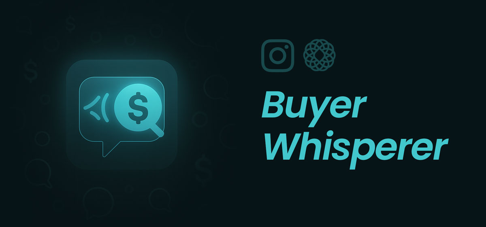
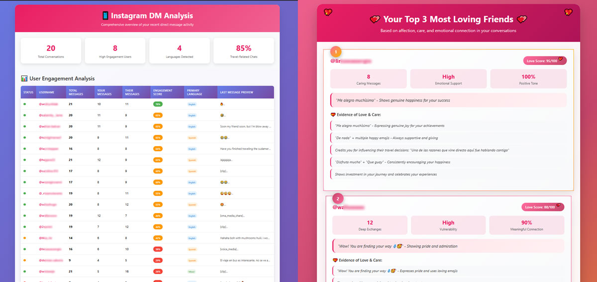

# The Buyer Whisperer

**Turn Your Instagram DMs into an AI-Powered Sales Engine.**

Buyer Whisperer is an intelligent command center that plugs directly into your Instagram DMs. Built on the revolutionary [**Gala Labs**](https://x.com/gala_labs) MCP Server, this tool uses AI to analyze conversations, surface your hottest leads, and help you craft perfect, human-like pitches to close more deals.

---
<p align="center">
  <a href="https://jonroura.com">
    
  </a>
</p>

---
<div align="center">

  

</div>

> This project is a proud submission to the **Gala Labs MCP Hackathon**. A massive thank you to the incredible team at **Gala Labs** for unlocking a new frontier in AI-powered communication.

<br />

## ✨ How It Works: The Magic of MCP

Buyer Whisperer creates a secure, real-time connection between your Instagram account and your AI assistant (Claude) using the **Model Context Protocol (MCP)**.

1.  **Command:** You give a simple, natural language command to Claude (e.g., "Who are my hottest leads?").
2.  **Analysis:** The Buyer Whisperer server securely fetches your latest DM conversations. It creates a compact, text-only brief and asks your AI to analyze it for key sales metrics.
3.  **Insight:** The AI returns a structured analysis, which the server uses to identify top users or generate pitch prompts.
4.  **Action:** The server presents the insights back to you as a beautiful artifact or asks for confirmation to send AI-generated messages on your behalf.

This entire process happens on-demand, in seconds, without ever storing your conversations after the session ends.

## 🧠 The Intelligence: AI-Powered Marketing KPIs

Buyer Whisperer doesn't just read messages; it understands them. It scores every user on these critical sales KPIs:

| KPI | What It Tells You |
| :--- | :--- |
| **Spending** | Flags hot leads already talking about buying. |
| **Price Focus** | Tells you if a discount hook will seal the deal. |
| **Trust** | No sale without belief in you, simple as that. |
| **Sentiment** | Mood check, lets you match tone before pitching. |
| **Curiosity** | High question count points to teach-then-sell copy. |
| **Language**| The user's primary language for multi-lingual pitching. |
| **Personality** | 5 adjectives to describe the user's vibe. |
| **Common Words** | The top 5 words the user repeats, great for mirroring. |

## 🎞 Result Examples
<p align="center">
  <a href="https://jonroura.com">
    
  </a>
</p>

---

## 🛠️ Installation & Setup Guide

Get up and running in under 5 minutes.

### Prerequisites

*   Python 3.11+
*   **The Claude Desktop App**
*   An active Instagram account

### Steps

1.  **Clone the Repository:**
    ```bash
    git clone https://github.com/trypeggy/instagram_dm_mcp.git
    cd instagram_dm_mcp
    ```

2.  **Install Dependencies:**
    ```bash
    pip install -r requirements.txt
    ```

3.  **Configure Credentials:**
    Copy the example environment file and add your credentials.
    ```bash
    cp env.example .env
    ```
    Now, open `.env` and fill in your `INSTAGRAM_USERNAME` and `INSTAGRAM_PASSWORD`.

4.  **Connect to Claude Desktop:**
    *   Find your Claude config file (e.g., `%APPDATA%\Claude\claude_desktop_config.json` on Windows).
    *   Add the following server configuration. **You must replace `FULL/PATH/TO/instagram_dm_mcp` with the actual path on your computer.**
    ```json
    {
      "mcpServers": {
        "insta_buyer": {
           "command": "python",
           "args": [
             "FULL/PATH/TO/instagram_dm_mcp/main.py"
           ]
        }
      }
    }
    ```

5.  **Restart Claude:**
    Quit and restart the Claude app. "Buyer Whisperer" will now be an available tool.

---

## ✅ The Command Manual

Prompt these simple, powerful commands in the Claude app to run the demo.

| Your Goal | The Command to Give Claude |
| :--- | :--- |
| **Get Full Analysis** | `Show me the analysis dashboard of my insta users.` |
| **Find Your Biggest Fans** | `Who loves me the most?` |
| **Find Price-Sensitive Users** | `Who is most price-sensitive?` |
| **Identify Unhappy Users**| `Who is starting to lose interest?` |
| **⭐ Tailor-Made Product Pitch To Your Top Lead** | `Pitch the new 'Avenger' sunglasses to my best lead. They cost $19.99 at https://amazon.com/avenger?tag=buyerwhisperer.` |
| **Confirm & Send Pitch**| `Send the pitch.` |


## License

This project is licensed under the MIT License. 


---
<div align="center">

Made with ❤️ in Barcelona by [Jon Roura](https://jonroura.com)

</div>